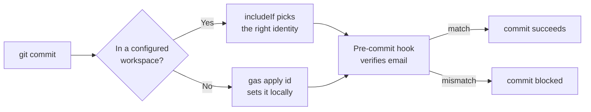

<p align="center">
  
</p>

<p align="center">
  <a href="https://github.com/luongnv89/git-auto-switch/actions/workflows/ci.yml"></a>
  <a href="https://pypi.org/project/git-auto-switch/"></a>
  <a href="https://www.npmjs.com/package/git-auto-switch"></a>
  <a href="https://opensource.org/licenses/MIT"></a>
</p>

# Stop pushing commits from the wrong GitHub account

`gas` switches your Git identity, SSH key, and remote URL per folder — or per
repo with one command. A pre-commit hook blocks email mismatches before they
hit `origin`.

```bash
cd ~/some/repo
gas apply work          # local user.email + SSH alias + remote, all set
```

[**Install ->**](#install) · [**Commands ->**](#commands) · [**Recipes ->**](#recipes)

## How It Works



| Layer | What `gas` configures |
|---|---|
| `~/.ssh/config` | Host aliases like `gh-work`, `gh-personal` -> the right key |
| `~/.gitconfig` | `includeIf.gitdir:` blocks per workspace |
| Repo `origin` | Rewrites `git@github.com:` -> `git@gh-work:` |
| Pre-commit hook | Aborts commits where `user.email` doesn't match the workspace |

## Install

Preferred — package managers first:

```bash
pip install git-auto-switch
```

```bash
npm install -g git-auto-switch
```

Curl installer (only when no package manager fits). Download it first so
you can inspect it, then run with an explicit checksum pin:

```bash
curl -fsSL https://raw.githubusercontent.com/luongnv89/git-auto-switch/main/install-curl.sh -o install-curl.sh
GAS_CHECKSUM=<sha256-of-the-release-tarball> bash install-curl.sh
```

Piping (`curl -fsSL .../install-curl.sh | bash`) still works but skips
pre-run inspection — avoid it when you can.

Verification: the installer downloads the release tarball to a file and
checks its SHA256 *before* extracting or executing anything. Precedence:
explicit `--checksum <sha256>` / `GAS_CHECKSUM` first, then a
`<tarball-url>.sha256` sidecar (override with `GAS_CHECKSUM_URL`). On
mismatch the download is deleted and the install aborts. With no checksum
available (e.g. `main` snapshots publish no sidecar) it warns and
continues — pin `GAS_CHECKSUM` for a verified install.

Every method installs the same Bash CLI, so all of them need Bash 3.2+,
Git 2.13+, and `jq` at runtime. Each method adds its own requirement:

- `pip install git-auto-switch` — Python >=3.11; the wheel bundles the
  CLI behind a Python launcher
- `npm install -g git-auto-switch` — Node >=22; the package wraps the
  CLI via a Node launcher
- `install-curl.sh` — `curl` and `tar`, plus `sha256sum` or `shasum`
  for the verified install
- `make install` from a clone — `make`

Both launcher shims check the runtime deps on first run and offer to
install missing ones via your package manager.

The PyPI and npm packages are published manually at release time. CI
(`.github/workflows/ci.yml`) runs lint and tests on every push and PR —
there is no automated release workflow yet.

## Commands

| Command | What it does |
|---|---|
| `gas init` | First-time setup wizard — adds your first account |
| `gas add` | Add another account (interactive) |
| `gas list` | Show all accounts and their workspaces |
| `gas current` | Show which account is active in the current directory (alias: `whoami`) |
| `gas apply` | Re-sync all configs (SSH, git, hooks, remotes) system-wide |
| `gas apply <id\|alias>` | Apply one account to the current repo only |
| `gas apply --yes` / `--no-prompt` | Same, never pausing for confirmation (CI/scripts) |
| `gas audit` | Scan repos for identity mismatches |
| `gas audit --fix` | Same, plus auto-correct what it finds |
| `gas validate` | Check the config for errors (overlapping workspaces, dup aliases, …) |
| `gas validate --check-ssh` | Same, also testing SSH connections without prompting |
| `gas validate --yes` / `--no-prompt` | Assume yes / skip optional checks (CI/scripts) |
| `gas remove <id>` | Drop an account |
| `gas version` / `gas help` | Self-explanatory |

## Recipes

Most workflows are 1-2 commands. The recipes below cover everything most
users will need.

### Set up your first two accounts

```bash
gas init
```

Walk through the prompts: account label, workspace folder(s), SSH key path,
git name, git email. The wizard validates the SSH key and tests GitHub auth
before saving.

```bash
gas add
```

Same prompts for the second account. After this, every repo inside a
configured workspace uses that account's identity automatically.

### "Which account am I committing as right now?"

```bash
gas current
```

Output:

```
========================================
  Current Account: work
========================================

  Account ID:  work
  Git Name:    John Doe
  Git Email:   john@company.com
  SSH Alias:   gh-work
  Directory:   /home/user/workspace/work/project
  Workspaces:
    - ~/workspace/work
    - ~/projects/company
```

Returns nothing if you're outside any configured workspace.

### Apply an account to a single repo

For one-off repos that sit outside any configured workspace, or to override
the workspace default for one project:

```bash
cd ~/some/repo
gas apply work
```

Or by SSH alias — both forms work:

```bash
gas apply gh-work
```

What it does:

- Sets local `user.name` / `user.email` (no `--global`)
- Adds the SSH alias to `~/.ssh/config` if it's missing
- Rewrites `origin` from `git@github.com:` -> `git@gh-work:`
- Switches the alias if `origin` was already pointing at a different one

Local config wins over `includeIf`, so this works inside or outside any
workspace.

### Find and fix wrong-identity repos

```bash
gas audit
```

Lists every repo whose `user.email` or remote alias doesn't match its
workspace. Read-only — won't change anything.

```bash
gas audit --fix
```

Same scan, but:

- Removes local `user.email` overrides so `includeIf` can take over
- Rewrites `git@github.com`, `ssh://git@github.com`, and `https://github.com` remotes to use the correct SSH alias

### Clone a new repo under the right account

```bash
git clone git@gh-work:org/repo.git
```

Use the SSH alias instead of `github.com` when cloning. If you forget,
`gas audit --fix` will rewrite it next time.

### Update everything after editing the config by hand

```bash
gas apply
```

Re-generates `~/.ssh/config`, `~/.gitconfig` includes, the pre-commit hook,
and rewrites remotes for every workspace.

## When Things Go Wrong

| Symptom | Command |
|---|---|
| Commit rejected with "email mismatch" | `gas current` to see expected, then `gas audit --fix` |
| Pushed but wrong account got credit | `gas audit` (read-only diagnostic), then fix the remote |
| `Permission denied (publickey)` | `gas list` -> verify key path, then `ssh -T git@gh-<alias>` |
| Just want to undo everything | Restore from `~/.git-auto-switch/backup/<timestamp>/` |

## Comparison

| | Manual `git config` | `gas` |
|---|---|---|
| Per-repo identity | Edit `.git/config` by hand | `gas apply <id>` |
| SSH key per account | Hand-crafted `~/.ssh/config` | Generated from one wizard |
| Wrong-email guard | None | Pre-commit hook (blocks before push) |
| Audit existing repos | Custom shell script | `gas audit` |

## License

[MIT](LICENSE)

---

<details>
<summary><b>Configuration file format</b></summary>

State lives in `~/.git-auto-switch/config.json`:

```json
{
  "version": "1.0.0",
  "accounts": [
    {
      "id": "work",
      "name": "Work Account",
      "ssh_alias": "gh-work",
      "ssh_key_path": "~/workspace/work/.ssh/id_ed25519",
      "workspaces": [
        "~/workspace/work",
        "~/projects/company"
      ],
      "git_name": "John Doe",
      "git_email": "john@company.com"
    }
  ]
}
```

Repository scans are cached per workspace under
`~/.git-auto-switch/cache/repo-scans/` so back-to-back commands (e.g.
`gas apply` then `gas audit --fix`) walk each workspace once. Entries
expire after `GAS_SCAN_CACHE_TTL` seconds (default `300`; set `0` to
disable).

Backups are written to `~/.git-auto-switch/backup/<timestamp>/` before
every change. Restore with:

```bash
cp ~/.git-auto-switch/backup/<timestamp>/ssh_config ~/.ssh/config
```

```bash
cp ~/.git-auto-switch/backup/<timestamp>/gitconfig ~/.gitconfig
```

</details>

<details>
<summary><b>Multiple workspaces per account</b></summary>

One account can map to several folders — useful when client work and
personal projects share an identity but live in different directories.

```
Workspace folder [~/workspace/work]: ~/workspace/work
Add another workspace? (leave empty to continue): ~/projects/company
Add another workspace? (leave empty to continue):
```

Edit later via `gas` -> option `[2] Manage workspaces`. `gas list`
shows the full set:

```
[work] Work Account
  Git:    John Doe <john@company.com>
  SSH:    gh-work
  Workspaces:
    - ~/workspace/work
    - ~/projects/company
    - ~/freelance/client-a
```

</details>

<details>
<summary><b>Install from source</b></summary>

```bash
git clone https://github.com/luongnv89/git-auto-switch.git
cd git-auto-switch
brew install jq          # or: sudo apt install jq
make install
```

To uninstall a curl-installed copy:

```bash
curl -fsSL https://raw.githubusercontent.com/luongnv89/git-auto-switch/main/install-curl.sh | bash -s uninstall
```

</details>

<details>
<summary><b>Development</b></summary>

```bash
brew install shellcheck bats-core jq
```

```bash
make lint     # ShellCheck
```

```bash
make test     # bats suite (223 tests)
bats test/    # same suite, direct invocation
```

```bash
make all      # both
```

See [CONTRIBUTING.md](CONTRIBUTING.md) for guidelines.

</details>

<details>
<summary><b>How identity switching works internally</b></summary>

1. **SSH keys** — separate ed25519 key per account, generated on first run if missing.
2. **SSH config** — host aliases (`gh-work`, `gh-personal`) routed to the right key in `~/.ssh/config`.
3. **Git config** — `includeIf.gitdir:` blocks in `~/.gitconfig` switch `user.name` / `user.email` based on the current directory.
4. **Pre-commit hook** — installed globally; aborts commits when `user.email` doesn't match the workspace's expected email.
5. **Remote rewriting** — `git@github.com:org/repo.git` is rewritten to `git@gh-<alias>:org/repo.git` so each push uses the right key.

</details>
